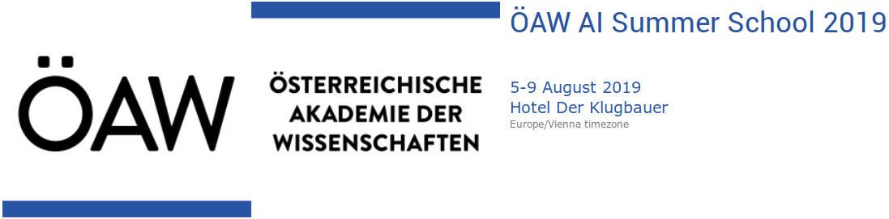

# oeawai

Material of the deep learning track of the ÖAW AI Summer School, v0.2

Open issues:
 * CNN.ipynb: AttributeError: 'CIFAR10' object has no attribute 'train_labels' (ditto train_data)
 * GAN.ipynb: RuntimeError: output with shape [1, 28, 28] doesn't match the broadcast shape [3, 28, 28]
   warning: /srv/conda/envs/notebook/lib/python3.7/site-packages/torchvision/datasets/mnist.py:43: UserWarning: train_labels has been renamed targets

